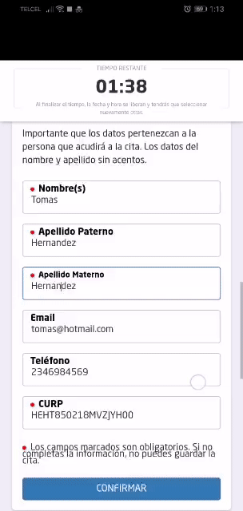

# [Zero Lines](https://cerofilas.veracruzmunicipio.gob.mx)
[](https://sonarcloud.io/dashboard?id=AyuntamientoVeracruz_CeroFilas)

Project for the generation, confirmation and evaluation of scheduled appointments and shifts for the attention of procedures carried out by the Government of the City of Veracruz.

## About Zero Lines 

Cero Filas was born at the initiative of the H. City Council of Veracruz in the 2018 - 2021 administration headed by Master Fernando Yunes Márquez, Municipal Constitutional President, the objective of said initiative is that through digital tools, the citizen is given the opportunity to choose date and time to attend the completion of a procedure and with it:

* Avoid long lines to attend to the completion of procedures
* Reduce the citizen's waiting time to be served
* Make the process of the processor more efficient to serve a citizen

The request for an appointment is carried out through the Cero Filas platform, entering [cerofilas.veracruzmunicipio.gob.mx](https://cerofilas.veracruzmunicipio.gob.mx)




.

The processor (tramitador in spanish) will have access to the platform by entering [cerofilas.veracruzmunicipio.gob.mx/sistema](https://cerofilas.veracruzmunicipio.gob.mx/sistema), This is where you can view past appointments and shifts, current and future appointments and shifts. Within this platform, the processor will be able to create a citizen's history or access it through the CURP.

To improve the attention of the processor to the citizen, the processor is given the evaluation tool, this will be carried out once the attention has been completed, and will arrive by email, here you can rate the attention and leave comments about the attention received and their experience when carrying out the procedure.

In the same way, there is an office administrator (entering the same system) who will be able to manage the catalogs of procedures and the processors who will carry out that procedure, as well as their opening hours for each of them. They will be able to manage the absences of processors to better plan citizen service.

It is a backend and frontend application, built with the Laravel 5.5 (PHP 7.1) framework using MySQL (5.0+) as a database manager.
Both views, model and controller were fully used with the Laravel framework.
It contains conventional forms and ajax invocations to the backend with information that has access to the database.

## Database

A database is used to store information about appointments and appointments in the entities: `shifts`, `appointments`. To reach these entities, you need to have catalogs of: `users`, `procedures`, `offices`, `dependencies`. And some additional relationship entities: `configurations`, `holdingappointments`, `tramitesxoficinas`, `tramitesxusers`, `ratings`, `absences`, `videos` and `marquees`.

Each of these entities is explained below.

### Appointment table

Table called `citations`. This entity stores appointments scheduled by portal visitors. It makes use of catalog entities such as [procedures](#table-of-procedures), [offices](#table-of-offices).

| Column name                   | Mandatory/optional column      | Datatype          | Detail                                               |
| ----------------------------- |------------------------------- | ----------------- | ---------------------------------------------------- |
| `id_cita`                     | Obligatoria                    | Numerico¹         | Autonumeric identifier of the appointment            |
| `tramite_id`                  | Obligatoria                    | Numerico¹         | Procedure identifier from the "procedures" table     |
| `oficina_id`                  | Obligatoria                    | Numerico¹         | Office identifier from the "offices" table           |
| `fechahora`                   | Obligatoria                    | Fechahora         | Appointment date and time                            |
| `nombre_ciudadano`            | Obligatoria                    | Texto             | Name(s) of the citizen registering the appointment   |
| `appaterno_ciudadano`         | Obligatoria                    | Texto             | Citizen's paternal surname                           |
| `apmaterno_ciudadano`         | Obligatoria                    | Texto             | Maternal surname of the citizen                      |
| `email`                       | Opcional                       | Texto             | Citizen email                                        |
| `curp`                        | Obligatoria                    | Texto             | Citizen's CURP                                       |
| `telefono`                    | Opcional³                      | Texto             | Citizen's telephone                                  |
| `folio`                       | Opcional                       | Texto             | Single folio of 8 character appointment              |
| `ip`                          | Opcional                       | Texto             | IP of the computer that records the appointment      |
| `statuscita`                  | Opcional                       | Texto²            | Appointment status (null or canceled)                |
| `created_by`                  | Opcional                       | Numerico¹         | Record creator user identifier                       |
| `created_at`                  | Opcional                       | Marca de tiempo   | Record creation timestamp                            |
| `updated_by`                  | Opcional                       | Numerico¹         | Registry Modifier User ID                            |
| `updated_at`                  | Opcional                       | Marca de tiempo   | Registry modification timestamp                      |

¹ Keep in mind that it is important to format the numbers so that the decimal separator is `.` and they should not
have thousands separators, quotes, currency characters, or other special characters.

² The appointment statuses are: `cancelled`, null. When an appointment is created, it does not have a status, it is only modified when canceled.

### Shift table

Table called `turns`. This entity stores the appointments (citizen check-in), it is when a citizen with an appointment or without an appointment shows up at the offices and marks their presence, if they have an appointment, then they bring with them an appointment sheet or QR. It makes use of catalog entities such as [procedures](#table-of-procedures), [offices](#table-of-offices), [citations](#table-of-appointments), [users](#table-of-users).

| Column name                   | Mandatory/optional column      | Datatype          | Detail                                               |
| ----------------------------- |------------------------------- | ----------------- | ---------------------------------------------------- |
| `id_turno`                    | Obligatoria                    | Numerico¹         | Autonumeric shift identifier                         |
| `cita_id`                     | Opcional                       | Numerico¹         | Citation identifier from the "citations" table            |
| `oficina_id`                  | Obligatoria                    | Numerico¹         | Office identifier of the "offices" table      |
| `user_id`                     | Opcional                       | Numerico¹         | Processor identifier of the "users" table      |
| `tramite_id`                  | Obligatoria                    | Numerico¹         | Procedure identifier of the "procedures" table      |
| `fechahora_inicio`            | Opcional                       | Fechahora         | Shift start date and time         |
| `fechahora_fin`               | Opcional                       | Fechahora         | Date and time of end of shift attention           |
| `observaciones`               | Opcional                       | TextoLargo        | Observations recorded by the processor regarding the attention of the shift |
| `nombre_ciudadano`            | Opcional                       | Texto             | Name(s) of the citizen who registers the shift       |
| `curp`                        | Obligatoria                    | Texto             | Citizen's CURP                                   |
| `email`                       | Opcional                       | Texto             | Citizen email                                  |
| `estatus`                     | Obligatoria                    | Enum²             | Shift status                                    |
| `folio`                       | Obligatoria                    | Texto             | Single turn folio of 8 characters              |
| `tiempoaproxmin`              | Obligatoria                    | Numerico¹         | Approximate time in minutes in which the shift will be attended |
| `created_by`                  | Opcional                       | Numerico¹         | Record creator user identifier        |
| `created_at`                  | Opcional                       | Marca de tiempo   | Record creation timestamp             |
| `updated_by`                  | Opcional                       | Numerico¹         | Registry Modifier User ID    |
| `updated_at`                  | Opcional                       | Marca de tiempo   | Registry modification timestamp         |


¹ Tener en cuenta que es importante formatear los numeros de forma tal que el separador decimal sea `.` y no deben 
contar con separadores de miles, comillas, caracter de moneda, ni otros caracteres especiales. 

² Los estatus del turno son: `creado`, `enproceso`, `finalizado`, `cancelado`. Estos estatus van cambiando conforme acciones del sistema.

### Tabla de usuarios

Tabla llamada `users`. Esta entidad almacena los usuarios del sistema (tramitadores, administrador de oficina, kiosko, turnera y super administrador). Cada tipo de usuario cuenta con diferentes acciones dentro del sistema. Hace uso de las entidades catálogo como [oficinas](#tabla-de-oficinas).

| Column name                   | Mandatory/optional column      | Datatype          | Detail                                              |
| ----------------------------- |------------------------------- | ----------------- | ---------------------------------------------------- |
| `id_user`                     | Obligatoria                    | Numerico¹         | Autonumeric user identifier               |
| `tipo_user`                   | Obligatoria                    | Enum²             | System user type                          |
| `estatus`                     | Obligatoria                    | Enum³             | User status                                  |
| `email`                       | Opcional                       | Texto             | Email of the user with whom you will log into the system |
| `password`                    | Opcional                       | Texto             | Password of the user with which you will log into the system |
| `nombre`                      | Obligatoria                    | Texto             | User name(s)                               |
| `oficina_id`                  | Obligatoria                    | Numerico¹         | Office identifier of the "offices" table       |
| `disponible_turno`            | Opcional                       | Enum⁴             | Indicates if the user is available to attend shifts|
| `ventanilla`                  | Opcional                       | Texto             | Alphanumeric code to indicate the window where the user attends the shifts |
| `REMEMBER_TOKEN`              | Opcional                       | Texto¹            | User session token                          |
| `created_by`                  | Opcional                       | Numerico¹         | Record creator user identifier       |
| `created_at`                  | Opcional                       | Marca de tiempo   | Record creation timestamp             |
| `updated_by`                  | Opcional                       | Numerico¹         | Registry Modifier User ID   |
| `updated_at`                  | Opcional                       | Marca de tiempo   | Registry modification timestamp         |


¹ Keep in mind that it is important to format the numbers so that the decimal separator is `.` and they should not
have thousands separators, quotes, currency characters, or other special characters.

² The system user types are: `superadmin`, `admin_officina`, `kiosko`, `processor`, `turnera`. The `superadmin` allows us to manage all the users of the system, the `adminoficina` manages the users and procedures of its jurisdiction, `kiosko` allows us to receive citizens by shift or appointment, `turnera` allows us to see the shifts and their status on the screen. assignment to service window.

³ Users can be active or inactive, an inactive user cannot log in to the system, nor is it taken into account for the calculations of the available hours of an office.

⁴ A user may (`yes`) or not (`no`) be available to attend a shift.

### Procedures table

Table called `procedures`. This entity stores the system procedures. A procedure can be assigned to a unit (a unit can have 1 or more offices). It makes use of catalog entities such as [dependencies](#dependencies-table).

| Column name         | Mandatory/optional column | Datatype      | Detail                                              |
| ----------------------------- |------------------------------- | ----------------- | ---------------------------------------------------- |
| `id_tramite`                  | Obligatoria                    | Numerico¹         | Autonumeric identifier of the procedure               |
| `nombre_tramite`              | Obligatoria                    | Texto             | Procedure name                                   |
| `requisitos`                  | Opcional                       | Texto             | Process requirements                               |
| `tiempo_minutos`              | Obligatoria                    | Entero            | Time in minutes that the process lasts                |
| `costo`                       | Obligatoria                    | Texto             | Cost of the procedure, it can be text                  |
| `codigo`                      | Obligatoria                    | Texto             | Unique procedure code                             |
| `dependencia_id`              | Opcional                       | Numerico¹         | Dependency identifier of the "dependencies" table |
| `warning_message`             | Opcional                       | Texto             | Alert message when deploying requirements |
| `created_by`                  | Opcional                       | Numerico¹         | Record creator user identifier        |
| `created_at`                  | Opcional                       | Marca de tiempo   | Record creation timestamp            |
| `updated_by`                  | Opcional                       | Numerico¹         | Registry Modifier User ID   |
| `updated_at`                  | Opcional                       | Marca de tiempo   | Registry modification timestamp        |


¹ Keep in mind that it is important to format the numbers so that the decimal separator is `.` and they should not
have thousands separators, quotes, currency characters, or other special characters.

### Office table

Table called `offices`. This entity stores the offices. An office is part of a unit, this means that a unit can have more than one office. It makes use of catalog entities such as [dependencies](#dependencies-table).

| Column name          | Mandatory/optional column | Datatype      | Detail                                                     |
| ----------------------------- |------------------------------- | ----------------- | ---------------------------------------------------- |
| `id_oficina`                  | Obligatoria                    | Numerico¹         | Autonumeric office identifier            |
| `nombre_oficina`              | Obligatoria                    | Texto             | Office name                                 |
| `slug`                        | Opcional                       | Texto             | Name slug the office                          |
| `dependencia_id`              | Obligatoria                    | Numerico¹         | Dependency identifier of the "dependencies" table  |
| `coords`                      | Obligatoria                    | Texto             | Office coordinates, format: lat, long      |
| `direccion`                   | Opcional                       | Texto             | Address in text of the office                      |
| `created_by`                  | Opcional                       | Numerico¹         | Record creator user identifier        |
| `created_at`                  | Opcional                       | Marca de tiempo   | Record creation timestamp             |
| `updated_by`                  | Opcional                       | Numerico¹         | Registry Modifier User ID    |
| `updated_at`                  | Opcional                       | Marca de tiempo   | Registry modification timestamp         |


¹ Keep in mind that it is important to format the numbers so that the decimal separator is `.` and they should not
have thousands separators, quotes, currency characters, or other special characters.

### Dependency table

Table called `dependencies`. This entity stores the dependencies. An office is part of a unit, this means that a unit can have more than one office. Only the database administrator can create a dependency.

| Column name                   | Mandatory/optional column | Datatype      | Detail                                              |
| ----------------------------- |------------------------------- | ----------------- | ---------------------------------------------------- |
| `id_dependencia`              | Obligatoria                    | Numerico¹         | Autonumeric identifier of the dependency         |
| `nombre_dependencia`          | Obligatoria                    | Texto             | Dependency name                             |
| `created_by`                  | Opcional                       | Numerico¹         | Record creator user identifier        |
| `created_at`                  | Opcional                       | Marca de tiempo   | Record creation timestamp             |
| `updated_by`                  | Opcional                       | Numerico¹         | Registry Modifier User ID    |
| `updated_at`                  | Opcional                       | Marca de tiempo   | Registry modification timestamp         |


¹ Keep in mind that it is important to format the numbers so that the decimal separator is `.` and they should not
have thousands separators, quotes, currency characters, or other special characters.

### Settings table

Table called `configurations`. This entity stores the configurations such as the Google Maps API key. Only the database administrator can create a dependency.

| Column name                   | Mandatory/optional column      | Datatype          | Detail                                               |
| ----------------------------- |------------------------------- | ----------------- | ---------------------------------------------------- |
| `id_configuracion`            | Obligatoria                    | Numerico¹         | Autonumeric configuration identifier       |
| `service_name`                | Obligatoria                    | Texto             | Service name                                  |
| `service_key`                 | Obligatoria                    | Texto             | Service key                                     |

¹ Keep in mind that it is important to format the numbers so that the decimal separator is `.` and they should not
have thousands separators, quotes, currency characters, or other special characters.

### Appointment booking table

Table called `holdingcitas`. This entity stores the appointment reservation, when a citizen on the portal is selecting a date, this date is retained so that it cannot be used for at least 5 minutes if it was not selected at the end. It makes use of catalog entities such as [procedures](#table-of-procedures), [offices](#table-of-offices). Temporary storage table.

| Column name          | Mandatory/optional column | Datatype      | Detail                                              |
| ----------------------------- |------------------------------- | ----------------- | ---------------------------------------------------- |
| `id_holdingcita`              | Obligatoria                    | Numerico¹         | Autonumeric identifier of the appointment reservation     |
| `tramite_id`                  | Opcional                       | Numerico¹         | Procedure identifier from the "procedures" table     |
| `oficina_id`                  | Obligatoria                    | Numerico¹         | Office identifier from the "offices" table     |
| `fechahora`                   | Obligatoria                    | Fechahora         | Appointment date and time                              |
| `folio`                       | Obligatoria                    | Texto             | Single 8-character appointment booking folio    |
| `created_at`                  | Opcional                       | Marca de tiempo   | Record creation timestamp             |
| `updated_at`                  | Opcional                       | Marca de tiempo   | Registry modification timestamp         |

¹ Tener en cuenta que es importante formatear los numeros de forma tal que el separador decimal sea `.` y no deben 
contar con separadores de miles, comillas, caracter de moneda, ni otros caracteres especiales. 

### Tabla de tramites por oficina

Tabla llamada `tramitesxoficinas`. Esta entidad almacena la relación de tramites y oficina. Hace uso de las entidades catálogo como [tramites](#tabla-de-tramites), [oficinas](#tabla-de-oficinas).

| Column name          | Mandatory/optional column | Datatype      | Detail                                              |
| ----------------------------- |------------------------------- | ----------------- | ---------------------------------------------------- |
| `id_tramitesxoficinas`        | Obligatoria                    | Numerico¹         | Autonumeric identifier of the procedure x office relationship |
| `tramite_id`                  | Obligatoria                    | Numerico¹         | Procedure identifier from the "procedures" table      |
| `oficina_id`                  | Obligatoria                    | Numerico¹         | Office identifier from the "offices" table      |
| `apply_date`                  | Opcional                       | Fechahora         | Appointment date and time                              |
| `created_by`                  | Opcional                       | Numerico¹         | Record creator user identifier        |
| `created_at`                  | Opcional                       | Marca de tiempo   | Record creation timestamp             |
| `updated_by`                  | Opcional                       | Numerico¹         | Registry Modifier User ID    |
| `updated_at`                  | Opcional                       | Marca de tiempo   | Registry modification timestamp         |

¹ Keep in mind that it is important to format the numbers so that the decimal separator is `.` and they should not
have thousands separators, quotes, currency characters, or other special characters.

### Table of procedures per user

Table called `tramitesxusers`. This entity stores the relationship of procedures and users. It makes use of catalog entities such as [tramites](#table-of-procedures), [users](#table-of-users).

| Column name          | Mandatory/optional column | Datatype      | Detail                                              |
| ----------------------------- |------------------------------- | ----------------- | ---------------------------------------------------- |
| `id_tramitesxusers`           | Obligatoria                    | Numerico¹         | Autonumeric identifier of the procedure x user relationship |
| `tramite_id`                  | Obligatoria                    | Numerico¹         | Procedure identifier from the "procedures" table     |
| `user_id`                     | Obligatoria                    | Numerico¹         | User identifier from the "users" table        |
| `lunes_inicio`                | Opcional                       | Tiempo            | Start time on Monday of that procedure and user |
| `lunes_fin`                   | Opcional                       | Tiempo            | End time on Monday of that procedure and user    |
| `martes_inicio`               | Opcional                       | Tiempo            | Start time on Tuesday of that procedure and user|
| `martes_fin`                  | Opcional                       | Tiempo            | End time on Tuesday of that procedure and user   |
| `miercoles_inicio`            | Opcional                       | Tiempo            | Start time on Wednesday of that procedure and user |
| `miercoles_fin`               | Opcional                       | Tiempo            | End time on Wednesday of that procedure and user|
| `jueves_inicio`               | Opcional                       | Tiempo            | Start time on Thursday of that procedure and user|
| `jueves_fin`                  | Opcional                       | Tiempo            | End time on Thursday of that procedure and user   |
| `viernes_inicio`              | Opcional                       | Tiempo            | Start time on Friday of that procedure and user |
| `viernes_fin`                 | Opcional                       | Tiempo            | End time on Friday of that procedure and user  |
| `sabado_inicio`               | Opcional                       | Tiempo            | Start time on Saturday of that procedure and user|
| `sabado_fin`                  | Opcional                       | Tiempo            | End time on Saturday of that procedure and user   |
| `created_by`                  | Opcional                       | Numerico¹         | Record creator user identifier        |
| `created_at`                  | Opcional                       | Marca de tiempo   | Record creation timestamp             |
| `updated_by`                  | Opcional                       | Numerico¹         | Registry Modifier User ID    |
| `updated_at`                  | Opcional                       | Marca de tiempo   | Registry modification timestamp         |

¹ Keep in mind that it is important to format the numbers so that the decimal separator is `.` and they should not
have thousands separators, quotes, currency characters, or other special characters.

### Evaluation table

Table called `ratings`. This entity stores the evaluation requested from the citizen regarding the attention of the processor, and in turn, it stores the rating granted if the evaluation is carried out, this derived from the attention shift. It makes use of catalog entities such as [shifts](#table-of-shifts).

| Column name          | Mandatory/optional column | Datatype      | Detail                                              |
| ----------------------------- |------------------------------- | ----------------- | ---------------------------------------------------- |
| `id_valoracion`               | Obligatoria                    | Numerico¹         | Autonumeric identifier of the evaluation          |
| `turno_id`                    | Obligatoria                    | Numerico¹         | Shift identifier from the "shifts" table          |
| `folio`                       | Obligatoria                    | Texto             | Single sheet of 8-character evaluation         |
| `estrellas`                   | Opcional                       | Tiempo            | Stars from the citizen to the processor for the attention received |
| `respuesta1`                  | Opcional                       | Tiempo            | Response 1 of the attention received                  |
| `respuesta2`                  | Opcional                       | Tiempo            | Response 2 of the attention received                  |
| `observaciones`               | Opcional                       | Tiempo            | Free text of observations of the care provided |
| `created_by`                  | Opcional                       | Numerico¹         | Record creator user identifier        |
| `created_at`                  | Opcional                       | Marca de tiempo   | Record creation timestamp             |
| `updated_by`                  | Opcional                       | Numerico¹         | Registry Modifier User ID    |
| `updated_at`                  | Opcional                       | Marca de tiempo   | Registry modification timestamp         |

¹ Keep in mind that it is important to format the numbers so that the decimal separator is `.` and they should not
have thousands separators, quotes, currency characters, or other special characters.

### Absence table

Table called `absences`. This entity stores the absences that each processor may have. The office administrator manages vacations (which is the availability that the processor will have in the future for his or her procedures). It makes use of catalog entities such as [users](#user-table).

| Column name          | Mandatory/optional column | Datatype     | Detail                                              |
| ----------------------------- |------------------------------- | ----------------- | ---------------------------------------------------- |
| `id_ausencia`                 | Obligatoria                    | Numerico¹         | Autonumeric identifier of the absence            |
| `user_id`                     | Obligatoria                    | Numerico¹         | User identifier from the "users" table        |
| `fecha_inicio`                | Obligatoria                    | Texto             | Start date of the user's absence           |
| `fecha_fin`                   | Obligatoria                    | Tiempo            | End date of the user's absence              |
| `motivo`                      | Opcional                       | Tiempo            | Reason for user absence                   |
| `created_by`                  | Opcional                       | Numerico¹         | Record creator user identifier       |
| `created_at`                  | Opcional                       | Marca de tiempo   | Record creation timestamp             |
| `updated_by`                  | Opcional                       | Numerico¹         | Registry Modifier User ID    |
| `updated_at`                  | Opcional                       | Marca de tiempo   | Registry modification timestamp         |

¹ Keep in mind that it is important to format the numbers so that the decimal separator is `.` and they should not
have thousands separators, quotes, currency characters, or other special characters.

### Video table

Table called `videos`. This entity stores the videos that each office will show on its screen if it uses a "Turnera" waiting screen. Only the database administrator can create a video.

| Column name          | Mandatory/optional column | Datatype      | Detail                                              |
| ----------------------------- |------------------------------- | ----------------- | ---------------------------------------------------- |
| `id_video`                    | Obligatoria                    | Numerico¹         | Autonumeric video identifier                |
| `urlvideo`                    | Obligatoria                    | Texto             | Video URL inside public_html/videos folder|
| `oficina_id`                  | Obligatoria                    | Numerico¹         | Office identifier from the "offices" table     |
| `orden`                       | Obligatoria                    | Numerico¹         | Video sequence order by office             |

¹ Keep in mind that it is important to format the numbers so that the decimal separator is `.` and they should not
have thousands separators, quotes, currency characters, or other special characters.

### Canopy table

Table called `canopies`. This entity stores the marquees that each office will display on its screen if it uses a "Turnera" waiting screen. Only the database administrator can create a marquee.

| Column name          | Mandatory/optional column | Datatype     | Detail                                              |
| ----------------------------- |------------------------------- | ----------------- | ---------------------------------------------------- |
| `id_marquesina`               | Obligatoria                    | Numerico¹         | Autonumeric marquee identifier          |
| `textomarquesina`             | Obligatoria                    | Texto             | Marquee Text                               |
| `oficina_id`                  | Obligatoria                    | Numerico¹         | Office identifier from the "offices" table      |

¹ Keep in mind that it is important to format the numbers so that the decimal separator is `.` and they should not
have thousands separators, quotes, currency characters, or other special characters.

## Files necessary for the correct functioning of the site

### Laravel Project

The Laravel project is made up of the following folders:

* [app](./app)
* [bootstrap](./bootstrap) 
* [config](./config)
* [database](./database)
* [resources](./resources)
* [routes](./routes)
* [tests](./tests)

And also the following files:
* [artisan](./artisan)
* [composer.json](./composer.json)
* [composer.lock](./composer.lock)
* [package.json](./package.json)
* [env](./env) Which must be renamed and adapted
* [vendor.zip](./vendors.zip) Which must be unzipped to the root path

### DB SQL File

The DB SQL file is as follows:
* [cerofila_db.sql](./cerofila_db.sql) Which as a requirement must manually create a user record of type `superadmin`, with the preferred email, and with an encrypted password ($2y$12$FGFyCBpT6HQ5aEvsx8rClu24ijnYfG9YcwBNhASecS8jxKoGk9FqW) which means 123456

### Public files

The public files are inside the following folder:
* [public_html](./public_html)

## Instructions for developers

To make modifications to the current site, perform the following steps:

* If you want to add or modify the images of the public app, you can do so by accessing [public_html/images](./public_html/images)
* If you want to add or modify the images of the administration app, you can do so by accessing [public_html/sis/images](./public_html/sis/images)
* If you want to add or modify the js scripts of the public app, you can do so by accessing [public_html/js](./public_html/js)
* If you want to add or modify the js scripts of the administration app, you can do so by accessing [public_html/sis/js](./public_html/sis/js)

### Aesthetic adaptation

To make style modifications to the current site, do the following:

* If you want to modify the styles of the public app, they must be modified from the file [public_html/css/app.css](./public_html/css/app.css)
* If you want to modify the styles of the administration app, they must be modified from the file [public_html/sis/css/style.css](./public_html/sis/css/style.css)

## Raise the project in a productive environment

### Requirements

It only requires a web server that has the following services:

* Apache (and optionally have the `Cron jobs` active).
* MySQL 5 or higher (that has the option to execute `Events` enabled)
* PHP 7.1 (with its mysqli extension active)

  
### First time installation

1. Clone the project using git.
2. Unzip the `vendor.zip` file.
3. Rename the `env` file to `.env`.
4. In your MySQL manager of choice, run the file [cerofila_db.sql](./cerofila_db.sql) to create the database on the destination server.
  * Insert a record in the `users` table with a user type `superadmin` with the email that the system administrator will use for access, and with the following password (already encrypted in md5): `$2y$12$FGFyCBpT6HQ5aEvsx8rClu24ijnYfG9YcwBNhASecS8jxKoGk9FqW` - which means: `123456` - you can later change the password once logged in.
  * Insert a record in the `configurations` table with the value for `service_name` of `google_maps`, and in `service_key` the value of API Key of your google maps account.
  * Check that the option to execute MySQL `Events` is enabled.
  * Create a procedure named `setAssignment` with the following content:
    
 ```sql
BEGIN	
	DECLARE finished,finishedusers BOOLEAN DEFAULT FALSE;
	DECLARE idOficina,idUser,idTurno,counter BIGINT DEFAULT 0;
	DECLARE curOficinas CURSOR FOR 
			SELECT id_oficina FROM oficinas ORDER BY id_oficina ASC;
	DECLARE CONTINUE HANDLER 
			FOR NOT FOUND SET finished = TRUE;
	OPEN curOficinas;        
	getOficina: LOOP
	
		FETCH curOficinas INTO idOficina;
		IF finished THEN 
			CLOSE curOficinas;
			LEAVE getOficina;
		END IF;
								
		BLOCKUSERS: BEGIN
		
		DECLARE curUsers CURSOR FOR
				SELECT id_user FROM users WHERE oficina_id=idOficina and disponibleturno="si" and estatus="activo"
				and id_user not in 
				(select user_id from turnos where estatus='enproceso' and oficina_id=idOficina) ORDER BY id_user ASC;
		DECLARE CONTINUE HANDLER
				FOR NOT FOUND SET finishedusers = TRUE;
		OPEN curUsers; 
		getUsers: LOOP
			
			FETCH curUsers INTO idUser;   
												
			IF finishedusers THEN
				SET finishedusers = FALSE;
				CLOSE curUsers;    
				LEAVE getUsers;
			END IF;
			
			SELECT count(*) into counter
			FROM turnos 
			LEFT JOIN tramitesxusers ON tramitesxusers.tramite_id=turnos.tramite_id 
			WHERE oficina_id=idOficina and turnos.estatus='creado' and Date(turnos.created_at)=CURDATE() and tramitesxusers.user_id=idUser
			ORDER BY cita_id IS NOT NULL desc, turnos.created_at asc LIMIT 1;
			
			IF counter>0 THEN
				SELECT id_turno INTO idTurno
				FROM turnos 
				LEFT JOIN tramitesxusers ON tramitesxusers.tramite_id=turnos.tramite_id 
				WHERE oficina_id=idOficina and turnos.estatus='creado' and Date(turnos.created_at)=CURDATE() and tramitesxusers.user_id=idUser
				ORDER BY cita_id IS NOT NULL desc, turnos.created_at asc LIMIT 1;    
				UPDATE turnos SET user_id=idUser,estatus='enproceso',fechahora_inicio=NOW() 
				WHERE id_turno = idTurno;
	
			END IF;				
			
		END LOOP getUsers;
		
		END BLOCKUSERS;
			
	END LOOP getOficina;
	
END
 ```
 * Create an event called `setAssignment` of type `recurrente` that is executed every `5 segundos` with a start date `ahora` without an end date, which calls the `setAssignment` procedure that we just created.	
 * Create another event called `expireholdingcita` of type `recurrente` to be executed every `1 minuto` with a start date `ahora` without end date with the following content:
 ```sql
DELETE FROM holdingcitas 
WHERE TIMESTAMPDIFF(MINUTE, created_at , NOW()) > 5
 ```
 * Create another event called  `setavailability` of type `recurrente` to be executed every `1 día` with start date `día actual 8pm` without end date with the following content:
 ```sql
UPDATE users 
SET disponibleturno='no'
 ```	
5. Edit the `.env` file. with the content of the connection data to the recently created database (in the DB_DATABASE,DB_USERNAME,DB_PASSWORD section). Also further down in this same file we must configure our connection data to the email that will execute shipments.
6. Create a folder with the name `cerofilas` in the root folder of the destination server (do not put it in public_html).
7. In this folder copy the mentioned folders (that we already downloaded) in [Laravel Project](#laravel-project) (and the recent `vendor` folder that was unzipped).
8. Also in the same folder copy the mentioned files (that we already downloaded) in [Laravel Project](#laravel-project), including the recent `.env` file that we edited with the connection data (no longer including the upload of the `vendor.zip` folder). And in this same `cerofilas` folder create the `storage/app/images` and `storage/framework/sessions` folders.
9. In the `public_html` folder that we downloaded there is a `htaccess` file, rename it to `.htaccess`.
10. Copy this file and all other files and folders in the `public_html` folder to the `public_html` folder on the destination server.
11. To see that everything is going well, run the domain url of our destination server, we will see the public app for creating appointments.
12. And try the domain url `/system` and use the user we created with the password `123456`. We should enter the administration app. If so, we can now create our users, procedures and relationships.
13. Optionally, if we want the system to send daily reminders, we must add the following command to the `Cron jobs` `wget http://urldedominio/sendrecordatorios` (donde urldedominio es la url de tu servidor destino), indicando que se ejecute diariamente a las 8am.

## License

This project is licensed under the MIT License - see the [LICENSE](./LICENSE) file for more details.

## Authors

* **Angel Cobos** - *H. Veracruz City Council* - [Email](mailto:angelcobos@outlook.com)
* **Damara Tejeda** - *H. Veracruz City Council* - [Email](mailto:damara9510@gmail.com)
